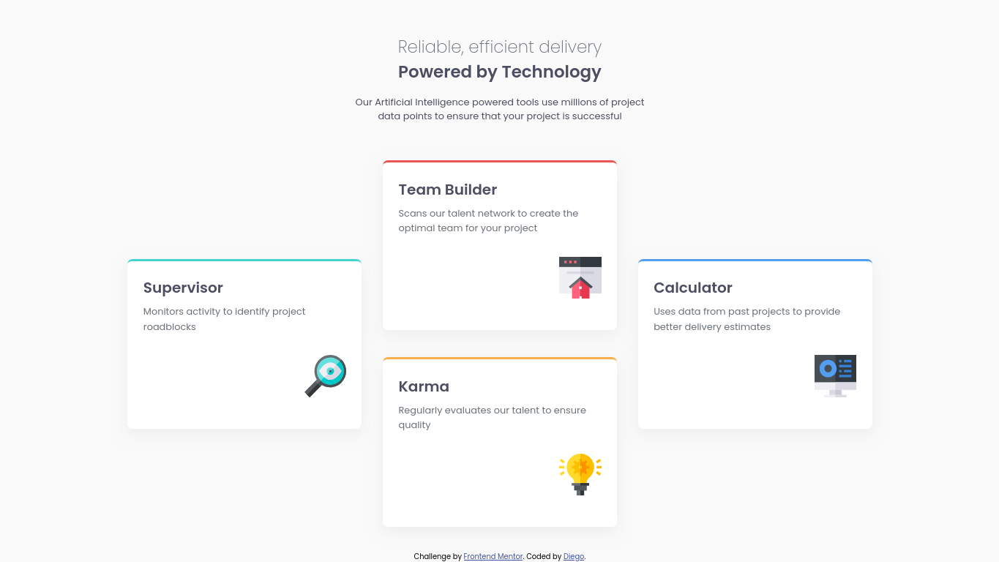
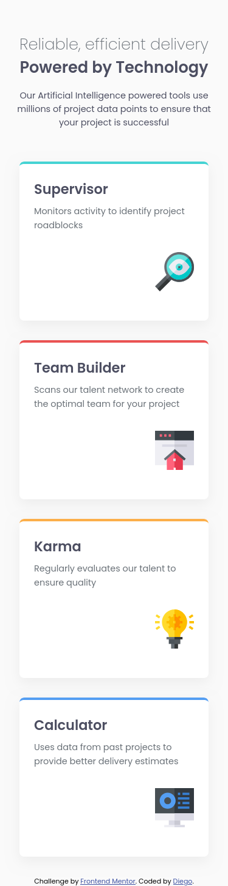

# Frontend Mentor - Four card feature section solution

This is my solution to the [Four card feature section challenge on Frontend Mentor](https://www.frontendmentor.io/challenges/four-card-feature-section-weK1eFYK). This challenge helped me practice layout techniques with CSS Grid and improve accessibility with semantic HTML.

### The challenge

Users should be able to:

- View the layout optimally on mobile and desktop
- Experience consistent spacing and alignment across all cards

### Screenshot

#### Desktop

#### Mobile

### Links

- Solution URL: [My solution on Frontend Mentor](https://www.frontendmentor.io/solutions/responsive-card-layout-using-css-grid-flexbox-and-semantic-html-9ru80YgFCN)
- Live Site URL: [Live site](https://diegobezerra80.github.io/four-card-feature-section/)

## My process

### Built with

- Semantic HTML5
- CSS custom properties
- Flexbox
- CSS Grid
- Mobile-first workflow

### What I learned

This project helped reinforce:

- Structuring responsive grids using `grid-template-columns` and `grid-template-rows`
- Using utility classes for consistent borders and spacing
- Accessibility practices like semantic landmarks (`<main>`, `<header>`, `<footer>`)
- Responsive sizing using `rem` and `em` units instead of `px`

### Continued development

- Continue using `clamp()` for more flexible typography
- Explore logical properties (`margin-block`, `padding-inline`) for better RTL support
- Practice combining Flexbox and Grid for advanced responsive layouts
